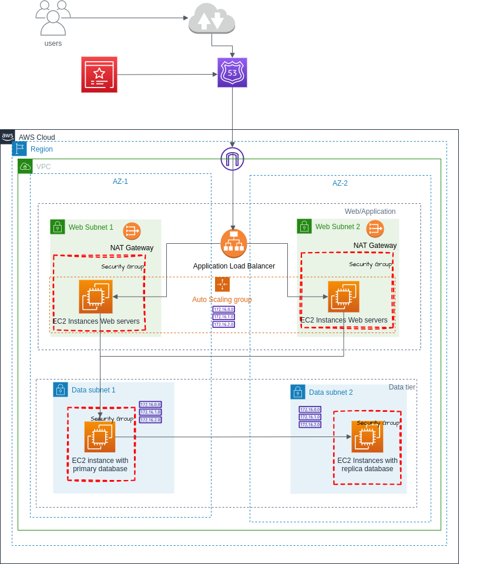

# Project Overview 

## Architecture Diagram



### Prerequisites
- AWS CLI installed on your local machine
- jq installed on your local machine
- Terraform installed on your local machine
- Docker installed on your local machine
- GitHub account

# ECR Login
Before the infrastructure deployment, we will build images for these applications and push them to separate ECR (Amazon Elastic Container Registry) repositories. 
For this, make sure you have AWS CLI installed and configured locally. We also need Docker to be running.

# AWS CLI Installation Guide

## Introduction

This guide provides step-by-step instructions for installing or updating the AWS Command Line Interface (CLI) on a Linux system.

## Prerequisites

- A Linux-based operating system
- `curl` installed on your system
- `unzip` installed on your system
- `sudo` privileges

## Installation Steps

1. **Download the AWS CLI Installer:**

   Use `curl` to download the AWS CLI v2 installer.

   ```sh
   curl "https://awscli.amazonaws.com/awscli-exe-linux-x86_64.zip" -o "awscliv2.zip"

2. **Unzip the Installer:**

    Unzip the downloaded installer package.

    ```sh
    unzip awscliv2.zip

3. Run the Installer:

    Use sudo to install the AWS CLI. The --bin-dir and --install-dir options specify the  installation directories.

    ```sh
    sudo ./aws/install --bin-dir /usr/local/bin --install-dir /usr/local/aws-cli --update
 
4. Verify the Installation:
    
    Check the version of the AWS CLI to ensure it has been installed or updated correctly.

    ```sh
    aws --version

5.  Create IAM User and Generate Access Keys:

    - Go to the AWS Management Console.
    - Navigate to the IAM (Identity and Access Management) service.
    - Create a new user (e.g., readmin) with Programmatic access.
    - Attach the necessary policies to the user. For an administrator, you typically attach the AdministratorAccess policy.
    - Generate and download the access key ID and secret access key for the user.

6. Configure AWS CLI

    Use the aws configure command to set up the new profile. Replace your-access-key-id and your-secret-access-key with the values you downloaded in the previous step, and your-region with your desired region 

    aws configure

    Follow the prompts:

    AWS Access Key ID [None]: your-access-key-id
    AWS Secret Access Key [None]: your-secret-access-key
    Default region name [None]: your-region
    Default output format [None]: json

7. Set the Environment Variables:

    ```sh
    export REGION=your-region
    export ACCOUNT_ID=your-account-id

# jq Installation Guide

1. Install jq:

    Use sudo apt-get to install jq.
    ```sh 
    sudo apt-get install jq

2. Verify jq Installation:
    
    Check the version of jq to ensure it has been installed correctly.
    ``sh
    jq --version

1. Login to ECR: replace region and AWS account ID. If you don't know where to find your account ID, please refer to this page. 
```
aws ecr get-login-password --region ${REGION} | docker login --username AWS --password-stdin ${ACCOUNT_ID}.dkr.ecr.${REGION}.amazonaws.com
```
2. Create ECR repositories: replace ecr_application_repo_name. This cmd line describes an ecr repository if it exists. Otherwise, it creates a new repository with the name specified.
```
ECR_APPLICATION_REPO_NAME=app-application-tier
aws ecr describe-repositories --repository-names ${ECR_APPLICATION_REPO_NAME} || aws ecr create-repository --repository-name ${ECR_APPLICATION_REPO_NAME}
```
Then, we will do the same for the presentation tier. 
```
ECR_PRESENTATION_REPO_NAME=app-presentation-tier
aws ecr describe-repositories --repository-names ${ECR_PRESENTATION_REPO_NAME} || aws ecr create-repository --repository-name ${ECR_PRESENTATION_REPO_NAME}
```
3. Build and push the images for each tier: replace ecr_application_repo_name with the one you specified earlier. 
```
cd ./application-tier/
ECR_APPLICATION_TIER_REPO=$(aws ecr describe-repositories --repository-names ${ECR_APPLICATION_REPO_NAME} | jq -r '.repositories[0].repositoryUri')
docker build -t app-application-tier .
docker tag app-application-tier:latest $ECR_APPLICATION_TIER_REPO:latest
docker push $ECR_APPLICATION_TIER_REPO:latest
```
Then, let's do the same for the presentation tier. 
```
cd ../presentation-tier/
ECR_PRESENTATION_TIER_REPO=$(aws ecr describe-repositories --repository-names ${ECR_PRESENTATION_REPO_NAME} | jq -r '.repositories[0].repositoryUri')
docker build -t app-presentation-tier .
docker tag app-presentation-tier:latest $ECR_PRESENTATION_TIER_REPO:latest
docker push $ECR_PRESENTATION_TIER_REPO:latest
```

Now, we should navigate to the Terraform folder and run `terraform init`.

We should run `terraform apply`, and type yes to approve the changes. It might take a while since we are provisioning a couple of resources. If everything goes as planned, you will get the DNS url for the front-facing load balancer.